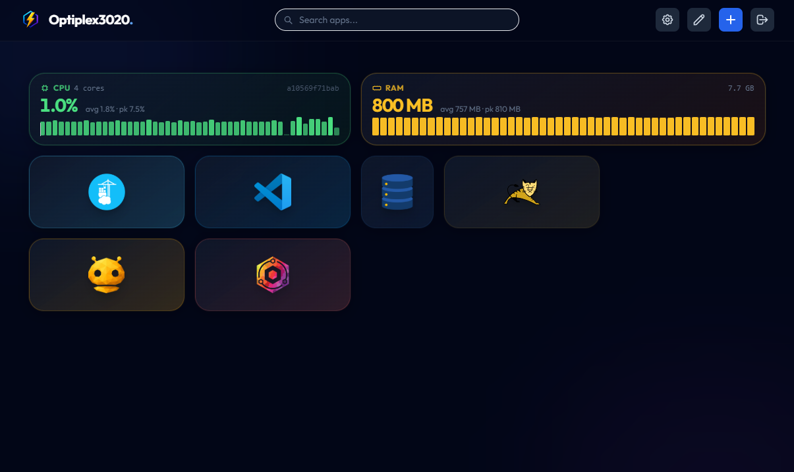

# Volt

A self-hosted home dashboard built with Go, HTMX, and Tailwind CSS. No JavaScript framework, no bloat — just a fast, clean page you can actually use.



## Features

- Dark and light mode
- Drag-and-drop link ordering
- Adjustable grid layout (2–10 columns)
- Auto-fetches icons from your links, with support for custom uploads
- Edit mode for bulk-selecting and deleting links
- Live CPU and RAM stats widget
- SQLite storage, no external database needed
- Runs well under 30MB RAM

## Stack

- [Go](https://go.dev/) + [Fiber](https://gofiber.io/)
- [HTMX](https://htmx.org/)
- [Tailwind CSS](https://tailwindcss.com/)
- [SQLite](https://www.sqlite.org/) (pure-Go driver, no CGO)

## Getting Started

You need Docker. That's it.

### Quick start

```bash
docker run -d \
  -p 8080:8686 \
  -v volt_data:/app/data \
  -v volt_uploads:/app/uploads \
  --name volt \
  --restart unless-stopped \
  ghcr.io/notaris/volt:latest
```

Then open `http://localhost:8080`.

### Docker Compose

```bash
curl -O https://raw.githubusercontent.com/notaris/volt/main/docker-compose.yml
docker compose up -d
```

### Local development

Requires Go 1.24+.

```bash
git clone https://github.com/notaris/volt
cd volt
go run main.go
```

## Configuration

| Variable | Description | Default |
| --- | --- | --- |
| `PORT` | Port to listen on | `8686` |
| `DB_PATH` | Path to the SQLite database file | `/app/data/volt.db` |

## Data

Volt stores everything in two directories:

- `/app/data` — SQLite database
- `/app/uploads` — custom icons

Mount these as volumes to persist data across container restarts.

## Contributing

Open an issue or PR if you find a bug or want to add something. Keep it simple.

## License

[MIT](LICENSE)
